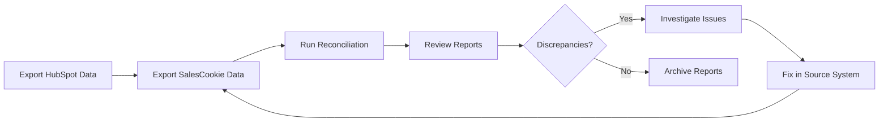

# Commission Reconciliation Tool - Complete Documentation

## Table of Contents

1. [Overview](#overview)
2. [Quick Start](#quick-start)
3. [Installation](#installation)
4. [Usage Guide](#usage-guide)
5. [Data Formats](#data-formats)
6. [Business Logic](#business-logic)
7. [Technical Architecture](#technical-architecture)
8. [API Reference](#api-reference)
9. [Troubleshooting](#troubleshooting)
10. [Best Practices](#best-practices)

## Overview

The Commission Reconciliation Tool automates the quarterly process of verifying that all "Closed & Won" deals in HubSpot are properly recorded in SalesCookie with correct commission calculations.

### Key Benefits

- **Time Savings**: Reduces manual reconciliation from hours to minutes
- **Accuracy**: Automated calculation verification reduces human error
- **Visibility**: Comprehensive reports highlight discrepancies immediately
- **Flexibility**: Supports multiple data sources and formats

### Core Features

- Multi-source data parsing (HubSpot CSV, SalesCookie manual/scraped)
- Intelligent deal matching with confidence scoring
- Automatic handling of centrally processed deals (CPI/Fix)
- Commission validation against yearly plans
- Comprehensive reporting in multiple formats
- Data quality assessment and recommendations

## Quick Start

### 1. Basic Reconciliation

```bash
# Reconcile Q3 2025 data
python3 reconcile_v2.py \
  --hubspot-file hubspot_export.csv \
  --salescookie-file "credits q3-2025.csv"
```

### 2. Multi-Quarter Analysis

```bash
# Analyze all available quarters
python3 reconcile_all_quarters.py
```

### 3. Data Quality Check

```bash
# Check data quality without full reconciliation
python3 reconcile_v2.py \
  --hubspot-file hubspot_export.csv \
  --salescookie-file credits.csv \
  --quality-check
```

## Installation

### System Requirements

- Python 3.8 or higher
- 100MB free disk space
- MacOS, Linux, or Windows

### Step-by-Step Installation

1. **Clone or download the repository**
   ```bash
   git clone [repository-url]
   cd commission_reconciliation
   ```

2. **Create virtual environment**
   ```bash
   python3 -m venv venv
   source venv/bin/activate  # On Windows: venv\Scripts\activate
   ```

3. **Install dependencies**
   ```bash
   pip install pandas openpyxl click
   ```

4. **Verify installation**
   ```bash
   python3 reconcile_v2.py --help
   ```

## Usage Guide

### Command Line Interface

#### Basic Syntax
```bash
python3 reconcile_v2.py [OPTIONS]
```

#### Options

| Option | Description | Required |
|--------|-------------|----------|
| `--hubspot-file PATH` | Path to HubSpot CSV export | Yes |
| `--salescookie-file PATH` | Path to manual SalesCookie export | One of these |
| `--salescookie-dir PATH` | Directory with scraped SalesCookie files | One of these |
| `--output-dir PATH` | Directory for output reports | No (default: ./reports) |
| `--data-source [manual\|scraped\|auto]` | Specify data source type | No (default: auto) |
| `--quality-check` | Run data quality check only | No |
| `--verbose` | Enable detailed logging | No |

### Usage Examples

#### Example 1: Quarterly Reconciliation
```bash
python3 reconcile_v2.py \
  --hubspot-file "../hubspot_exports/q3_2025.csv" \
  --salescookie-file "../salescookie_manual/credits q3-2025.csv" \
  --output-dir "./reports/q3_2025"
```

#### Example 2: Using Scraped Data
```bash
python3 reconcile_v2.py \
  --hubspot-file hubspot_all_deals.csv \
  --salescookie-dir "../scraped_data/" \
  --data-source scraped
```

#### Example 3: Historical Analysis
```bash
# First, analyze all quarters
python3 analyze_all_quarters.py

# Then run comprehensive reconciliation
python3 reconcile_all_quarters.py
```

## Data Formats

### HubSpot Export Format

Export deals from HubSpot with these required fields:

| Field Name | Description | Example |
|------------|-------------|---------|
| Record ID | Unique deal identifier | 270402053362 |
| Deal Name | Full deal name | Software License@Aktia Bank |
| Deal Stage | Must be "Closed & Won" | Closed & Won |
| Amount in company currency | Deal amount | 50000 |
| Close Date | ISO date format | 2025-07-15 |
| Currency in company currency | Currency code | EUR |
| Deal Type | Deal classification | New Business |
| Associated Company Names (Primary) | Company name | Aktia Bank Abp |
| Types of ACV | Revenue type | Software |
| Product Name | Product sold | Regnology Regulatory |
| Weigh. ACV product & MS & TCV advisory | EUR equivalent | 50000 |

### SalesCookie Export Format

Manual export format (recommended):

| Field Name | Description | Example |
|------------|-------------|---------|
| Unique ID | HubSpot Record ID | 270402053362 |
| Deal Name | Full deal name | Software License@Aktia Bank |
| Customer | ID; Company format | 100123; Aktia Bank Abp |
| Close Date | Datetime format | 2025-07-15 00:00:00 |
| Commission | Commission amount | 3650 |
| Commission Currency | Currency code | EUR |
| Commission Rate | Rate with % | 7.30% |
| Deal Type | Deal classification | New Business |
| ACV (EUR) | Annual contract value | 50000 |
| Split | Quarter split indicator | Yes/No |

### Scraped Data Issues

Common problems with scraped data:
- Truncated deal names ending with "..."
- Different ID format (e.g., 20351301806 vs 270402053362)
- Missing customer ID prefix
- Incomplete field extraction

## Business Logic

### Commission Rate Structure

#### 2024 Commission Plan
```
Software: 7.3%
Managed Services (Public): 5.9%
Managed Services (Private): 7.3%
Professional Services (Recurring): 2.9%
Indexations & Parameter: 8.8%
PS Deals (Flat): 1%
```

#### 2025 Commission Plan
```
Software: 7%
Managed Services (Public): 7.4%
Managed Services (Private): 8.4%
Professional Services (Recurring): 3.1%
Indexations & Parameter: 9.3%
PS Deals (Flat): 1%
```

### Special Deal Types

#### CPI/Fix Increase Deals
- Identified by keywords: "CPI Increase", "Fix Increase", "Indexation"
- Processed centrally, not through standard HubSpot flow
- Automatically excluded from missing deal reports

#### Professional Services (PS) Deals
- Identified by "PS @" prefix in deal name
- Flat 1% commission rate regardless of amount
- May have 50/50 quarter splits between close and service start

### Matching Algorithm

The tool uses a confidence-based matching hierarchy:

```
1. ID Match (100% confidence)
   └─ Exact Unique ID match
   
2. Name + Date Match (95% confidence)
   ├─ Exact deal name match
   └─ Close date within ±1 day
   
3. Company + Date Match (80-90% confidence)
   ├─ Normalized company name
   ├─ Close date within ±7 days
   └─ Amount similarity boosts confidence
```

### Quarter Split Logic

For deals with split commissions:
- 50% allocated to close quarter
- 50% allocated to revenue start quarter
- Applies to multi-quarter service agreements

## Technical Architecture

### Component Overview

```
┌─────────────────┐     ┌──────────────────┐     ┌─────────────────┐
│  HubSpot CSV    │────▶│  HubSpot Parser  │────▶│                 │
└─────────────────┘     └──────────────────┘     │                 │
                                                  │  Reconciliation │
┌─────────────────┐     ┌──────────────────┐     │     Engine      │
│ SalesCookie CSV │────▶│ SalesCookie      │────▶│                 │
└─────────────────┘     │ Parser V2        │     └────────┬────────┘
                        └──────────────────┘              │
                                                          ▼
                        ┌──────────────────┐     ┌─────────────────┐
                        │ Report Generator │◀────│  Discrepancies  │
                        └────────┬─────────┘     └─────────────────┘
                                 │
                ┌────────────────┼────────────────┐
                ▼                ▼                ▼
         ┌──────────┐     ┌──────────┐    ┌──────────┐
         │  Excel   │     │   CSV    │    │  Text    │
         │ Report   │     │ Export   │    │ Summary  │
         └──────────┘     └──────────┘    └──────────┘
```

### Core Components

#### 1. HubSpot Parser (`hubspot_parser.py`)
- Loads and validates HubSpot CSV exports
- Filters for Closed & Won deals
- Normalizes data formats
- Calculates PS deal indicators

#### 2. SalesCookie Parser V2 (`salescookie_parser_v2.py`)
- Dual-mode parser (manual/scraped)
- Automatic data source detection
- Quality assessment and scoring
- Handles multiple CSV formats

#### 3. Reconciliation Engine V2 (`reconciliation_engine_v2.py`)
- Multi-strategy matching algorithm
- CPI/Fix deal identification
- Commission validation
- Discrepancy detection

#### 4. Report Generator (`report_generator.py`)
- Excel workbook creation
- CSV discrepancy export
- Text summary generation
- Formatted output

### Data Flow

1. **Input Stage**
   - Load HubSpot deals
   - Load SalesCookie transactions
   - Validate data quality

2. **Processing Stage**
   - Identify centrally processed deals
   - Execute matching strategies
   - Validate commissions
   - Generate discrepancies

3. **Output Stage**
   - Create summary statistics
   - Generate detailed reports
   - Export findings

## API Reference

### HubSpotParser

```python
class HubSpotParser:
    def __init__(self, file_path: str)
    def parse(self) -> List[Dict]
    def summary(self) -> Dict
```

#### Usage Example
```python
parser = HubSpotParser('hubspot_export.csv')
deals = parser.parse()
summary = parser.summary()
print(f"Found {summary['total_deals']} deals worth €{summary['total_amount']:,.2f}")
```

### SalesCookieParserV2

```python
class SalesCookieParserV2:
    def parse_file(self, file_path: str, source: DataSource = None) -> Tuple[List[Dict], DataQualityReport]
    def detect_data_source(self, df: pd.DataFrame, file_path: str) -> DataSource
    def assess_data_quality(self, df: pd.DataFrame, source: DataSource) -> DataQualityReport
```

#### Usage Example
```python
parser = SalesCookieParserV2()
transactions, quality = parser.parse_file('credits.csv', DataSource.MANUAL)
print(f"Quality score: {quality.quality_score}/100")
```

### ReconciliationEngineV2

```python
class ReconciliationEngineV2:
    def __init__(self, hubspot_deals: List[Dict], salescookie_transactions: List[Dict])
    def reconcile(self, data_quality_score: float = 100.0) -> ReconciliationResult
```

#### Usage Example
```python
engine = ReconciliationEngineV2(hubspot_deals, salescookie_transactions)
results = engine.reconcile(quality.quality_score)
print(f"Matched {results.summary['matched_deals_count']} deals")
```

## Troubleshooting

### Common Issues and Solutions

#### 1. Low Match Rate (<50%)

**Symptoms**: Few deals matching between systems

**Possible Causes**:
- Time period mismatch
- Incomplete data export
- Many CPI/Fix deals

**Solutions**:
```bash
# Check date ranges in both files
python3 analyze_q3_2025.py

# Verify CPI deal handling
python3 reconcile_v2.py --verbose
```

#### 2. Import Errors

**Symptoms**: "No module named 'pandas'" or similar

**Solution**:
```bash
# Ensure virtual environment is activated
source venv/bin/activate
pip install pandas openpyxl click
```

#### 3. CSV Parsing Errors

**Symptoms**: "Error tokenizing data" or encoding errors

**Solutions**:
- Ensure CSV is saved with UTF-8 encoding
- Check for special characters
- Verify delimiter (comma vs semicolon)

#### 4. Commission Discrepancies

**Symptoms**: Matched deals with wrong commission amounts

**Possible Causes**:
- Quarter splits not considered
- Wrong year rates applied
- PS deals not identified

**Debug Steps**:
```bash
# Enable verbose mode
python3 reconcile_v2.py --verbose

# Check specific deal in both systems
# Review Commission Details field
```

### Debug Mode

Enable detailed logging:
```bash
export PYTHONPATH=.
python3 -m pdb reconcile_v2.py --hubspot-file data.csv --salescookie-file credits.csv
```

### Log Analysis

Check logs for:
- Data quality warnings
- Matching attempts and failures
- Commission calculation details
- CPI deal identification

## Best Practices

### 1. Data Preparation

- **Export Complete Data**: Include all required fields
- **Use Manual Exports**: Prefer manual SalesCookie exports over scraped
- **Verify Time Periods**: Ensure matching date ranges
- **Check Encoding**: Save CSVs with UTF-8 BOM encoding

### 2. Regular Reconciliation

- **Quarterly Schedule**: Run within first week of quarter end
- **Monthly Checks**: Optional mid-quarter verification
- **Year-End Review**: Comprehensive annual reconciliation

### 3. Report Review Process

1. **Check Match Rate**: Should be >70% for complete data
2. **Review High-Impact Discrepancies**: Focus on >€1000 differences
3. **Verify CPI Deals**: Ensure centrally processed deals are excluded
4. **Investigate Missing Deals**: Check eligibility and sync status

### 4. Data Quality Monitoring

- **Track Quality Scores**: Manual exports should score 90-100
- **Monitor Truncation**: Deal names should never end with "..."
- **Verify ID Formats**: HubSpot IDs should be 12 digits
- **Check Completeness**: All required fields should be present

### 5. Process Integration



## Appendix

### A. File Structure

```
commission_reconciliation/
├── reconcile_v2.py              # Main CLI interface
├── reconcile_all_quarters.py    # Multi-quarter analysis
├── analyze_q3_2025.py          # Quarter-specific analysis
├── hubspot_parser.py           # HubSpot data parser
├── salescookie_parser_v2.py    # SalesCookie parser
├── reconciliation_engine_v2.py # Matching engine
├── report_generator.py         # Report generation
├── commission_config.py        # Rate configuration
├── tests/                      # Test suite
│   ├── test_reconciliation.py
│   └── test_integration.py
├── reports/                    # Output directory
└── README.md                   # Quick reference

```

### B. Sample Commands

```bash
# Q3 2025 reconciliation
python3 reconcile_v2.py \
  --hubspot-file "../hubspot_data/2025_q3.csv" \
  --salescookie-file "../salescookie_manual/credits q3-2025.csv" \
  --output-dir "./reports/2025_q3"

# Full year analysis
python3 reconcile_all_quarters.py

# Data quality check
python3 reconcile_v2.py \
  --hubspot-file data.csv \
  --salescookie-file credits.csv \
  --quality-check

# Verbose debugging
python3 reconcile_v2.py \
  --hubspot-file data.csv \
  --salescookie-file credits.csv \
  --verbose \
  --output-dir "./debug_reports"
```

### C. Error Codes

| Code | Description | Action |
|------|-------------|--------|
| 0 | Success | None |
| 1 | General error | Check logs |
| 2 | File not found | Verify file paths |
| 3 | Invalid data | Check CSV format |
| 4 | No deals found | Verify filters |

---

*Last updated: July 2025*